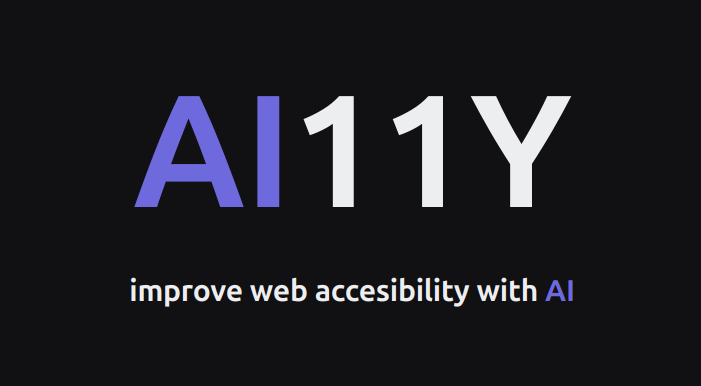

# AI11Y



## Improve your web accecibility with AI

AI11Y is powered with the language model gpt-3.5-turbo of OpenAI and uses
Vercel AI SDK that abstracts away the differences between model providers, eliminates boilerplate code for building chatbots, and allows you to go beyond text output to generate rich, interactive components.

## Features

- Improve semantic HTML
  Provide some HTML code and receive an output semantically enhanced by the AI,
  you gonna receive scores and suggestions to improve and learn, also you can compare your input
  and output code.

- Enhance color contrasts
  Provide background and foreground colors to check contrast ratios based on WCAG guidelines,
  also AI can provide and suggest similar colors to try, keeping good color contrasts.

## Install

Install packages

```bash
npm install
```

Start the dev server

```bash
npm run dev
```

## Licence

2024 - [Benjamin Aguilar](https://github.com/benjaAguilar) aka ColorCode
